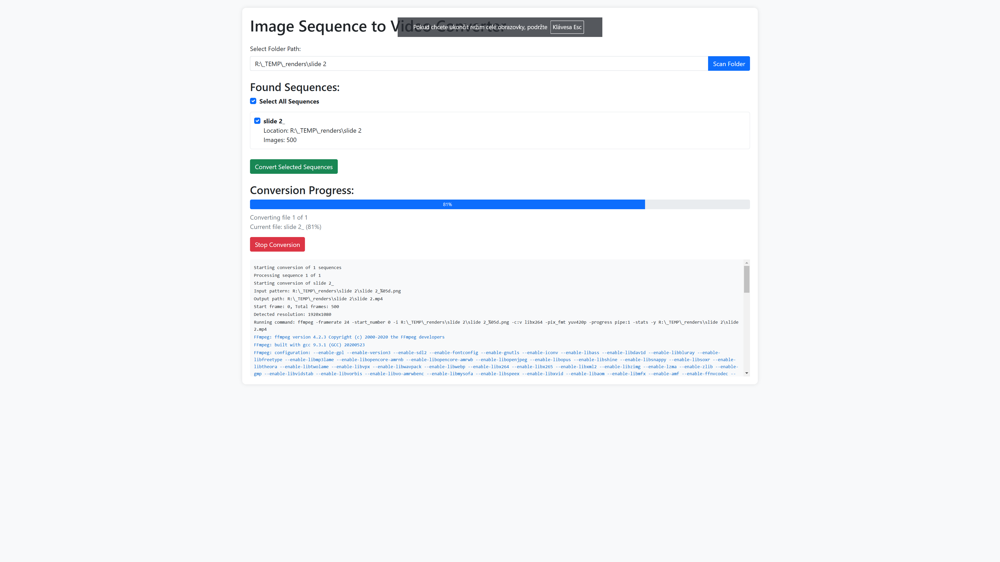

# Image Sequence to Video Converter

A Flask web application that converts image sequences to MP4 videos using FFmpeg.

[](screenshot.png)

## Prerequisites

- Python 3.7 or higher
- FFmpeg installed and available in system PATH
- pip (Python package installer)

## Installation

1. Clone this repository or download the files
2. Install the required Python packages:
```bash
pip install -r requirements.txt
```

### Stable project-local environment (recommended on Windows)

Use the launcher script to keep the app pinned to its own `.venv`:

```bash
run_app.bat
```

It creates `.venv` on first run, installs dependencies, and always starts the app with that interpreter.

### macOS / Linux setup

Create and use a local virtual environment:

```bash
python3 -m venv .venv
source .venv/bin/activate
python -m pip install --upgrade pip
pip install -r requirements.txt
python app.py
```

Then open `http://localhost:5000`.

## Usage

1. Run the Flask application:
```bash
python app.py
```

2. Open your web browser and navigate to `http://localhost:5000`

3. Enter the folder path containing your image sequences

4. Click "Scan Folder" to find all image sequences

5. Select the sequences you want to convert

6. For EXR sequences, click **Configure EXR** and select one or more AOVs to export

7. Adjust framerate, quality, and loop count settings as needed

8. For each EXR sequence, optionally toggle **Delete EXR temp PNG files after conversion**

9. Click "Convert Selected Sequences" to start the conversion process

## Features

- Scans folders and subfolders for image sequences
- Supports PNG, JPG, and JPEG formats
- Supports EXR sequences with AOV selection
- Exposes top-level `R/G/B/A` EXR channels as a merged `Beauty` AOV
- Automatically detects image sequences based on naming patterns
- Converts sequences to MP4 using H.264 codec
- Adds silent audio track for better TV/device compatibility
- Supports custom framerate settings
- Supports quality presets (CRF/preset)
- Allows looping sequences multiple times
- Shows real-time conversion progress and detailed logs
- Shows stage-by-stage progress (EXR preprocessing first, then MP4 creation)
- EXR preprocessing uses a small process pool (4 workers) for faster EXR to PNG conversion
- Handles odd-dimension images by adding padding
- Names output videos based on sequence names

## Notes

- Image sequences should be numbered consecutively
- EXR processing requires Python packages: `OpenEXR`, `numpy`, and `Pillow`
- If Conda is used, install the Python bindings with:
  - `conda install -c conda-forge openexr-python`
- EXR conversion uses temporary PNG files in the same source folder and removes them after conversion
- EXR temp PNG cleanup can be configured per EXR sequence with the "Delete EXR temp PNG files after conversion" checkbox
- Beauty pass is converted from linear EXR to display-referred sRGB before PNG/MP4 export
- The application uses FFmpeg with the following settings:
  - Codec: H.264 (video), AAC (audio)
  - Pixel format: yuv420p
  - Silent audio track: 48kHz sample rate
- Output videos will be saved in the same folder as the image sequences
- The conversion can be stopped at any time using the "Stop Conversion" button